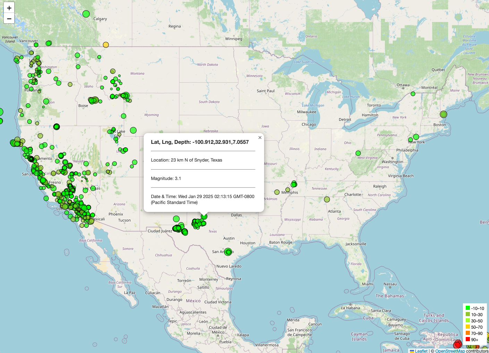

# Earthquake Data
Module 15 Challenge

## Project Description
The United States Geological Survey, or USGS for short, is responsible for providing scientific data about natural hazards, the health of our ecosystems and environment, and the impacts of climate and land-use change. Their scientists develop new methods and tools to supply timely, relevant, and useful information about the Earth and its processes. 

This analysis will allow them to visualize their earthquake data that will allow them to better educate the public and other government organizations (and hopefully secure more funding) on issues facing our planet.

## This visualization was built with
- Leaflet
- HTML
- CSS
- Javascript
- D3

## Features
**The Map** 
The map is based on the coordinates of [37.09, -95.71], and each marker indicates an incident of an earthquake of the last 7 days.

**Markers**
- Markers correspond with the size of the earthquake's magnitude level
- The color reflects the depth level of the earthquake
- By clicking the marker, a pop up will appear with the details of the coordinates, magnitude, date and time of the occurence

**Legend** 
The legend represends the depth of the earthquake and their corresponding color

**Sample Image**

HTML view available <a href="index.html">here</a>

## References
Dataset provided by the ["United States Geological Survey All Earthquakes from the Past 7 Days"](http://earthquake.usgs.gov/earthquakes/feed/v1.0/geojson.php) 
Maps provided from ["OpenStreetMap"](https://www.openstreetmap.org/copyright)